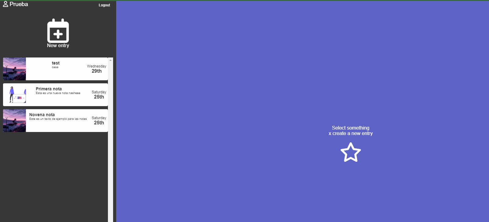
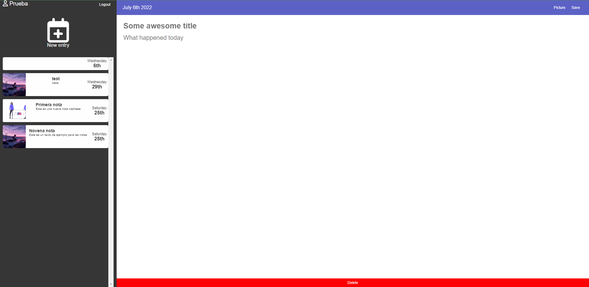

# Aplicativo de diario con React
En esta aplicación se usa varias tecnologias para hacer un sistema de login con ayuda de firebase, ademas se usa un servicio en la nube para poder almacenar las imagenes las cuales son enlazadas a los usuarios para poder cargar las notas.

Algunas de las tecnologias usadas son:
- HTML
- CSS
- Sass
- JavaScript
- React
- Redux toolkit
- Firebase

## Capturas de la Aplicación

>Login

>Dashboard

>Crear nueva nota

